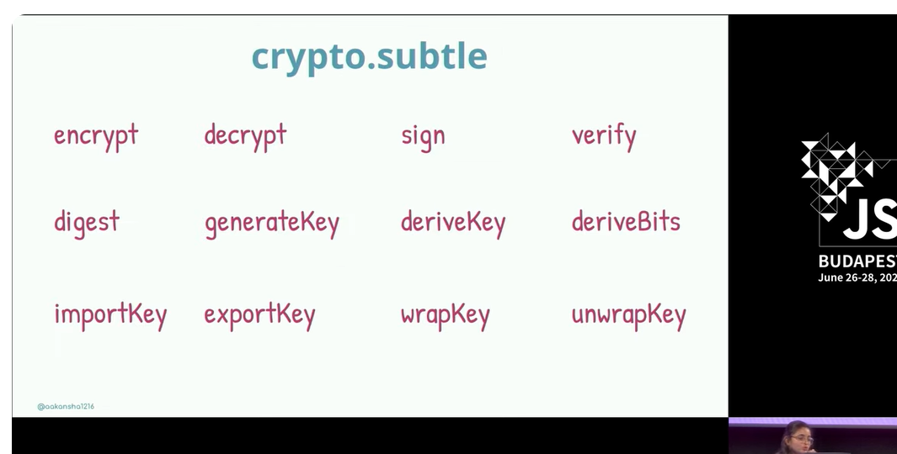
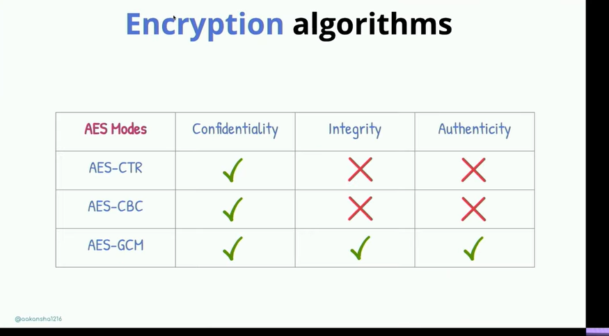

# ChatAppUI

This project was generated with [Angular CLI](https://github.com/angular/angular-cli) version 18.2.8.

## Development server

Run `ng serve` for a dev server. Navigate to `http://localhost:4200/`. The application will automatically reload if you change any of the source files.

## Code scaffolding

Run `ng generate component component-name` to generate a new component. You can also use `ng generate directive|pipe|service|class|guard|interface|enum|module`.

## Build

Run `ng build` to build the project. The build artifacts will be stored in the `dist/` directory.

## Running unit tests

Run `ng test` to execute the unit tests via [Karma](https://karma-runner.github.io).

## Running end-to-end tests

Run `ng e2e` to execute the end-to-end tests via a platform of your choice. To use this command, you need to first add a package that implements end-to-end testing capabilities.

## Further help

To get more help on the Angular CLI use `ng help` or go check out the [Angular CLI Overview and Command Reference](https://angular.dev/tools/cli) page.

---

https://danielk.tech/home/angular-login-form-with-tailwind-css

https://medium.com/@gabrielbastosdeveloper/real-time-application-development-with-signalr-and-angular-74c7d869afaf

https://damienbod.com/2018/05/13/uploading-and-sending-image-messages-with-asp-net-core-signalr/

## https://medium.com/@tony.infisical/guide-to-nodes-crypto-module-for-encryption-decryption-65c077176980

# Window Crypto APIs

[Youtube Vid of a talk talking about crypto apis.](https://www.youtube.com/watch?v=cZTHGPn1jdU)

_APIs present for crypto.subtle:_

RSA -> Asymmetrical Algorithm.
AES -> Symmetrical Algorithm.

_AES Algorithms and their properties:_

> By Integrity and Authenticity mentioned here, it means if a data is encrypted with AES-GCM, the decryption fails hence offering more security.

//article on import
https://developer.mozilla.org/en-US/docs/Web/API/SubtleCrypto/importKey#pkcs_8

//Reference for an E2EE chat app in angular
https://github.dev/wiringbits/safer.chat/blob/master/web/src/app/components/chat/chat.component.ts

openssl genrsa -out user1-private.pem 2048
openssl rsa -in user1-private.pem -pubout -out user1-public.pem

cp user1-public.pem user1-p /mnt/c/Users/Shivam/keys

## Dockerize Angular

https://dev.to/oneofthedevs/docker-angular-nginx-37e4

https://www.youtube.com/watch?v=-o5l6zFJ9_o

https://github.com/marketplace/actions/render-deploy-action
